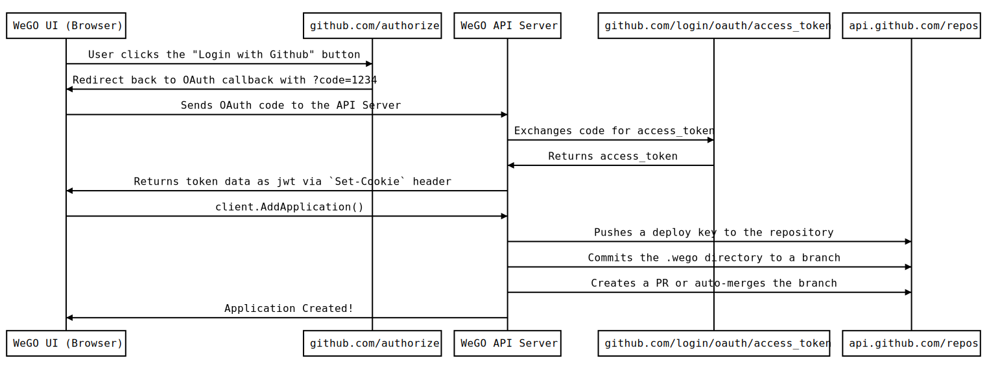
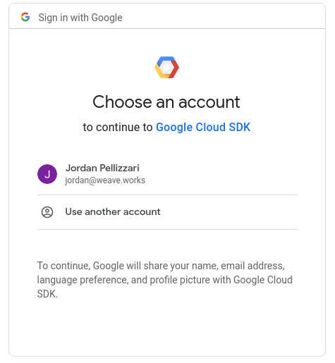

# 5. Weave GitOps Core Auth Strategy

Date: 2021-07-22

## Status

Accepted

## Problem

Weave GitOps needs to be able to do read and write operations against three different "back ends":

- The git repository for an Application
- The repository "host" (Github, Gitlab, Bitbucket, etc), known as a Git Provider, for an Application
- The Kubernetes cluster where we want to run the Application. (**Note: this doc does not seek to address K8s authn/authz. That will need to be a separate ADR)**

Each of these back ends have different authn/authz requirements:

### Git Repository

The operations for the git repository are the typically the ones done with the `git` CLI, ie: `git clone`, `git commit`, `git push`. We assume that git providers will allow for repository-specific keys to be added; GitHub and Gitlab calls these "deploy keys", other providers might call them "access keys". These are typically ssh key-pairs.

These deploy keys are outside the scope of a git repo, so we will need a higher level of access in the form of a Git Provider access token to add deploy keys programmatically.

### Git Provider

Operations such as creating pull requests (or "merge requests" in the case of Gitlab), adding deploy keys, and retrieving user data will need to be completed via HTTP requests. Each major Git Provider has some form of OAuth flow:

- [Github Device Flow](https://docs.github.com/en/developers/apps/building-github-apps/identifying-and-authorizing-users-for-github-apps#device-flow)

  - This approach doesn't require a `client_secret` or callback page
  - We can do these steps from a browser
  - Access tokens cannot be refreshed, and expire in a matter of minutes (GitHub docs suggest 900 seconds, which may be configurable)
  - Users will need to do this often if using GitHub

- [Gitlab Proof Key for Code Exchange (PKCE) Flow](https://docs.gitlab.com/ee/api/oauth2.html#authorization-code-with-proof-key-for-code-exchange-pkce)

  - Note that the documentation explicitly calls out that PKCE is optimal for client-side apps without a public cloud server (our use case)
  - The documentation example specifies a `client_secret`, but that may be a documentation bug. A `client_secret` should not be necessary

- [Bitbucket Implicit Grant](https://developer.atlassian.com/cloud/bitbucket/oauth-2/#2--implicit-grant--4-2-)s

  - No `client_secret` required here

- [Github Web Application Flow](https://docs.github.com/en/developers/apps/building-github-apps/identifying-and-authorizing-users-for-github-apps#web-application-flow)
  - Note: this flow **does** require a `client_secret`, so to utilize it, users will need to create their own GitHub app (`client_id` and `client_secret` pair), then secure and reveal those to Weave GitOps as environment variables.
  - This is considered the "advanced" use case for users who wish to install Weave GitOps as a permanent resident in the cluster.
  - See the Design -> Advanced Use Case section below

### Kubernetes Cluster

All operations will need to go through an API server that is installed on the cluster via the `wego gitops install` command. This API server will run with a service account that provides the ability to do the following:

- Create `Namespace` resources
- Create `Application`, `Source`, and `Kustomize|Helm` resources
- Create, Read, Update, List, and Destroy privileges Kubernetes objects in the `wego-system` namespace

### Security Concerns

Each of the Git Providers listed above support some sort of "personal access token" that allow for "impersonation" style authorization. These tokens never expire, and provide "sudo" access to the user's Github account.

For this reason, we want to utilize the more short-lived OAuth tokens to avoid exposing a personal access token. We also don't want to persist these tokens longer than we have to.

In addition, flows that require a `client_secret` would require us to embed it in the binary, which leaves us open to exposing it via decompilation. For that reason, we will NOT be implmenting the Access Code Grant flow for the basic use case (see Design -> Advanced Use Case for more info).

### UX Concerns

Given that the Weave GitOps UI and API server may be running on a user's cluster, we may not always know the OAuth callback URL ahead of time. For this reason, we will need to use OAuth flows that do not require a static `redirect_uri`. The flows listed above in the Git Providers section fit that constraint.

We will need to ensure that the `redirect_uri` is configurable by the user via environment variables. This will allow users to run and expose the UI/API servers on whichever endpoint they choose.

## Design

Since most modern Git Providers will support a form of browser-based OAuth, **we will utilize the browser for both the CLI and UI authentication with Git Providers**.

In the case of the CLI, we can utilize a short-lived browser session that will recieve the OAuth callback and pass the token to the CLI.

**Note that we can skip the OAuth portion of the flow we detect a Weave Gitops-specific access_token environment variable. For example, if `WEGO_GITHUB_ACCESS_TOKEN` or `WEGO_GITLAB_ACCESS_TOKEN` is present in the environment, we will use that token.**


UI auth will work in a similar way, with a more straight-forward set of steps:



TLDR:

1. The user does OAuth with their Git Provider
2. We use the resulting access_token to push a Deploy Key to the repository (giving us `git` permissions)
3. We create a pull request for the repository via the Git Provider HTTP API

For browser security, we will convert the Git Provider OAuth token to a JSON Web Token (JWT) to protect against Cross-site Scripting (XSS) attacks. The encrypted JWT will allow a malicious script to authenticate with the Weave GitOps API only, whereas passing the unencrypted OAuth token to the browser would allow a malicious script to authenticate with the Github API.

In the intitial implementation, the key for encrypting and decrypting the JWT will be read as an environment variable. If the environment variable is not present, Weave GitOps will randomly generate a key on startup and store it in memory; this assumes a "singleton" installation with no horizontal scalability, and that every time Weave GitOps starts up, users will need to re-authenticate.

Additionally, we do not plan on adding third-party scripts to the Weave GitOps UI to minimize the surface area for XSS attacks. This does NOT, however, account for NPM modules or other dependencies that we add to our app at build time.

In any of the documented flows from the Git Provider section, the `client_id` will be publicly exposed on every OAuth request via URL parameters. One possible attack vectory for exploiting the `client_id` will be to saturate the Git Provider and fill a given `client_id` request quota, effectively doing a denial-of-service attack. Luckily, it appears that Git Providers do their rate limiting on a per user or per IP Address basis:

[Github docs on user-to-server rate limits](https://docs.github.com/en/developers/apps/building-github-apps/rate-limits-for-github-apps#normal-user-to-server-rate-limits)

[Gitlab.com docs on rate limits](https://docs.gitlab.com/ee/user/gitlab_com/index.html#gitlabcom-specific-rate-limits)

[Bitbucket docs (see "How calls are measured" section)](https://support.atlassian.com/bitbucket-cloud/docs/api-request-limits/)

### Advanced Use Case

Most users who want to use Weave GitOps in a production setting will want to set up an OAuth 2.0 Authorization Code Grant flow, as this provides the best user experience\*. Weave GitOps will allow for configuration of such a flow by consuming environment variables supplied by the user. Users will need to register an application with their desired Git Provider supply their own `client_id` and `client_secret`, effectively taking the storing of those values out of the purview of Weave GitOps.

\*Access tokens from the Authorization Code Grant can be refreshed, so the user needs to complete the OAuth flow less often.

### Alternatives Considered

We considered these alternative impelmentations when designing our solution:

- Store a Git Provider personal access token in the cluster as a secret: we decided against this approach as it would leave a very priveleged credential inside a running cluster for an indefinite period of time (forever).

- Use a public-facing cloud endpoint to handle OAuth callbacks and `client_secret` security: users might not want us "phoning home", and we are not in a position to implement and maintain new cloud services.

### Prior Art

This authentication approach is inspired by other CLI tools that have very smooth user experiences. For example, the `gcloud` CLI for Google Cloud Platform utilizes the browser to authenciate the user:

```
$ gcloud auth login

Your browser has been opened to visit:

https://accounts.google.com/o/oauth2/auth?response_type=code&client_id=1234.apps.googleusercontent.com&redirect_uri=http%3A%2F%2Flocalhost%3A8085%2F&scope=...

Opening in existing browser session.

```

In the browser:



<hr />

GitHub's own CLI works in a similar way, and allows users to pass in their own token:

[https://cli.github.com/manual/gh_auth_login](https://cli.github.com/manual/gh_auth_login)

```
Authenticate with a GitHub host.

The default authentication mode is a web-based browser flow.

Alternatively, pass in a token on standard input by using --with-token. The minimum required scopes for the token are: "repo", "read:org".
```

## Decision

Implement the flow(s) defined in the "Design" section

## Consequences

This document does not seek to provide any mapping between Kubernetes users and Git Provider users. That may be out of scope for the Weave GitOps Core edition, or may be implemented later.
